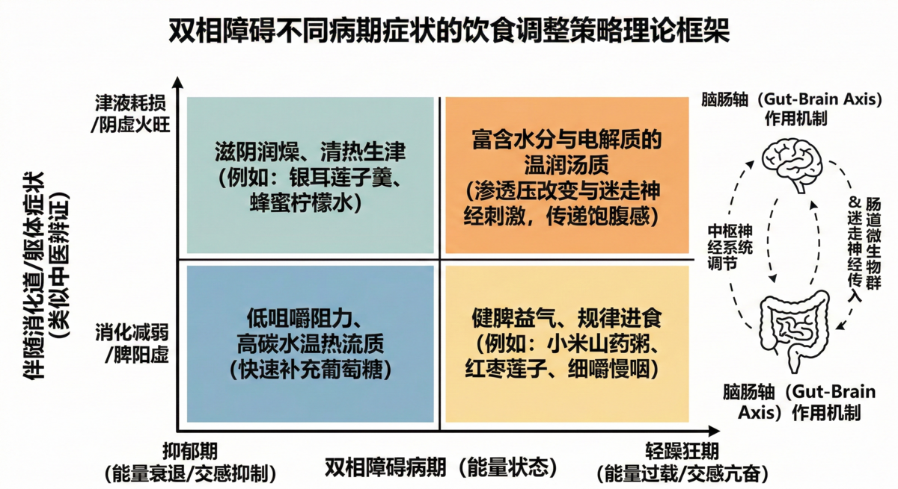

# AI辅助双相障碍自我管理：一例6个月随访的探索性病例报告

<strong>AI-Assisted Self-Management of Bipolar Disorder: A 6-Month Follow-up Case Report</strong>

## 摘要

**背景**：双相障碍是一种慢性和高度致残的精神疾病。尽管心境稳定剂和抗精神病药物是基础治疗，但在真实世界中，患者常面临医疗资源可及性不足、信息获取滞后以及躯体合并症等挑战。近年来，基于大语言模型的人工智能（AI）对话系统在心理健康支持领域初露端倪，但其在双相障碍长期自我管理中的实际应用经验仍然匮乏。

**病例介绍**：患者为二十余岁男性，在读人工智能专业博士生。于2024年11月在某三甲医院精神科确诊为双相II型障碍。患者接受拉莫三嗪（150 mg/d）与喹硫平（25 mg/d）的常规西药治疗。在此基础上，自2025年8月至2026年2月（共6个月），患者自主使用AI对话系统（主要为Gemini、Claude与GPT）辅助自我管理。干预内容包括对症状演变的即时分析、基于药理学与营养学的补充剂调整建议、基于“1:2定律”的自主神经物理微调（艾灸），以及结合中医辨证和脑肠轴假说的个体化饮食管理。在6个月内，患者共记录了3,734条AI交互消息，累积消耗约1.55亿Tokens。这些高频交互主要用于纵向症状日记的分析、复杂药理学文献的交叉比对，以及部分时段的认知支持。

**结果**：6个月的随访期内，患者主观报告其整体情绪稳定性有所改善，抑郁期的社会与职业功能损害减轻，未出现需卧床休养的重度功能受损情况。此外，通过个体化饮食与物理微调干预，患者报告部分伴随的躯体症状（如心悸、焦虑）得到了较快缓解，甚至在特定时期内成功替代了短效抗焦虑药物（奥沙西泮），且未增加额外的经济负担。然而，在2025年10月，因患者向AI输入了不完整的用药史（未提及服用L-酪氨酸），导致AI给出了不当的干预建议，引发了短期的症状波动与功能衰退，后经患者自行鉴别并调整方案后恢复。

**结论**：本病例提示，AI对话系统在双相障碍的自我管理中可能具备提供即时信息支持、缓解躯体不适以及促进患者参与的辅助价值。然而，过度依赖AI存在诱发错误医疗决策的风险，尤其是在信息输入不完整或缺乏专业医疗审核的情况下。此类工具的应用要求患者具备极高的健康素养与批判性思维。本案例的经验仍需在大样本、对照研究中进一步验证。

**关键词**：双相障碍；人工智能；自我管理；脑肠轴；病例报告

**数据可用性声明**：本报告涉及的完整脱敏交互数据集、论文全文及可视化分析工具已开源发布，可通过以下地址访问：[https://phd-tianlv.github.io/bipolar-ai-management](https://phd-tianlv.github.io/bipolar-ai-management)

## 1. 引言

双相障碍（Bipolar Disorder, BD）是一种以情绪极端波动为特征的慢性重性精神疾病，全球患病率约为1%至3% [1,2]。其中，双相II型障碍以反复的重度抑郁发作和轻躁狂发作为特征，患者常伴有严重的躯体与心理共病，长期社会功能损害显著 [3,4]。目前的临床指南推荐以心境稳定剂与第二代抗精神病药物为主的长期药物治疗 [5]。然而，在日常管理中，患者常面临就诊等待时间长、医患沟通不充分、治疗依从性差等问题 [6]。

近年来，数字健康（Digital Health）技术在慢性病管理中的应用逐渐普及 [7]。特别是在心理健康领域，人工智能对话系统由于具备即时可用、信息整合能力强以及相对中立和“无评判性（non-judgmental）”的交互特征，正在成为辅助干预的新型工具 [8,9]。近期的研究表明，由于不需要面对真实的医疗人员，患者在使用聊天机器人时更倾向于真实地披露自身的敏感症状和不良习惯 [10]。

尽管数字心理干预在抑郁和焦虑领域已有初步证据支持 [11]，但AI系统在双相障碍长期自我管理中的真实世界应用报告依然稀缺。本文报告了一例双相II型障碍患者在常规药物治疗基础上，自主使用AI对话系统进行长达6个月多维度自我管理的完整案例，旨在探讨其潜在的辅助价值与潜藏风险。

## 2. 病例介绍

### 2.1 临床评估与就诊史

患者为男性，二十余岁，人工智能专业在读博士生。自述情绪剧烈波动史约10年，主要表现为周期性的情绪低落与精力亢奋交替出现。2024年11月12日，因“情绪波动大10年，且近期持续10天睡眠需求显著减少并伴随精力过盛”首次就诊于某三甲医院精神科。结合临床病史，医师初步诊断为心境[情感]障碍（双相障碍）。2024年11月27日复诊时，医师开具了拉莫三嗪（初始剂量25 mg bid）与富马酸喹硫平（25 mg qn），并配以奥沙西泮作为备用。

经过数月的药物滴定，拉莫三嗪剂量稳定在150 mg/d。至2025年2月，患者情绪波动幅度有所收窄，但仍存在每半月出现10至15天情绪低落及精力减退的周期性发作，对其科研工作与日常生活造成持续影响。

### 2.2 AI辅助自我管理的引入

在确诊之前，患者曾尝试过传统中药汤剂及心理咨询，但自感疗效有限或难以长期负担。基于其专业背景对大语言模型的熟悉，患者自2025年8月起，决定在继续维持常规西药治疗的前提下，将AI对话系统作为自我管理的辅助工具。

患者主要使用的模型包括Gemini（Google）、Claude（Anthropic）以及GPT（OpenAI）。使用策略通常为“并行咨询（parallel prompting）”与“多模型交叉验证（Multi-model Cross-validation）”，即患者将详细的病史、近期用药记录及动态症状以系统提示词（System Prompt）的形式输入，通过比对不同AI模型（共计2,620次模型切换）的输出，以辅助自身进行健康决策并规避单一模型的“幻觉”。

## 3. 干预与管理过程

在6个月的随访期内（2025年8月至2026年2月），患者记录了3,734条AI交互消息，累积消耗约1.55亿Tokens。利用自然语言处理技术对这些交互记录的初步分析显示，患者的核心讨论主题主要集中于躯体症状（32%）、营养补充剂（29%）与物理及食疗干预（24%）。自我管理方案主要包括四个维度：常规药物维持、营养补充剂干预、个体化饮食管理与物理微调。

### 3.1 药物与补充剂管理

患者在维持拉莫三嗪（150 mg/d）与喹硫平（25 mg/d）治疗的基础上，通过AI系统查阅药理学及临床营养学文献，设计并调整了针对性的补充剂与中成药辅助方案。该方案在基线期（稳定期）主要包括L-茶氨酸（约400 mg/d）、N-乙酰半胱氨酸（NAC，600 mg/d）、Omega-3脂肪酸（EPA，1000 mg/d）、维生素D3（5000 IU/d）、B族维生素（B-50）、胶原蛋白肽（6 g/d）、全谱消化酶以及中成药乌灵胶囊（6粒/d）；在夜间额外补充磷脂酰丝氨酸（200 mg/d）及甘氨酸镁（400 mg/d）。AI在这一过程中的作用主要体现为对补充剂剂量、服用时间（如早晚分配、餐前餐后分布）及潜在药物相互作用的机制解释。

### 3.2 基于病期与体质的饮食调整

基于AI系统提供的中西医结合视角的知识整合，患者尝试将“脑肠轴（Gut-Brain Axis）”理论与中医“辨证论治”理念应用于日常饮食。患者记录到，在不同的情绪周期（抑郁期、轻躁狂期或稳定期），其伴随的消化道症状（如食欲改变、便溏、口干）存在显著差异。

通过与AI的互动，患者形成了一种尝试性的“病期×体质”动态饮食策略（详见图1）。例如，在抑郁期伴随严重精力衰退和消化能力减弱时，采用低咀嚼阻力、高碳水的温热流质饮食（如小米粥），以期通过减少消化系统的负荷来快速补充葡萄糖；在轻躁狂期伴随交感神经亢奋及口咽干燥时，倾向于选择温润汤质（如椰子鸡汤），试图通过局部渗透压改变和迷走神经刺激来诱发饱腹感与平抑亢奋。患者主观报告，这种低成本的日常饮食微调能够较为即时地缓解部分躯体不适。

*图1：双相障碍不同病期症状的饮食调整策略。结合病期（能量状态）与躯体症状，提供个体化的营养干预方案。*
### 3.3 基于阴阳平衡的自主神经物理微调（艾灸）

针对伴随双相障碍发作期出现的严重焦虑、心悸及失眠等自主神经功能紊乱症状，患者在AI辅助下，结合中医经络理论，探索出了一套以“艾灸”为主的物理干预标准作业程序（SOP）。

干预早期，患者曾尝试单独艾灸上焦穴位（如内关、神门）以缓解焦虑，却出现口干、心烦加剧的负作用。通过在AI模型中推演，患者认识到这属于“烤干津液、助长虚火”。随后，患者通过反复试错确立了<strong>“1:2平衡定律”</strong>：即艾灸上焦穴位1份时间，必须配合艾灸下焦穴位（如涌泉、太冲）2份时间。该定式意在“引火归元”，在平抑交感神经极度亢奋的同时温煦末梢循环 [16,17]。主观报告显示，在严格执行该物理干预SOP后，患者在10月至11月的轻度躁狂/焦虑并发期内，将其短效抗焦虑药物（奥沙西泮）的使用量降至极低，甚至观察到了实现完全替代的可能性。

## 4. 临床结局与风险事件

### 4.1 症状与功能改善的主观评估

经过6个月的辅助管理，患者主观报告其疾病的周期性规律被部分钝化。尽管抑郁期仍然出现，但精力衰竭的深度有所减轻，患者在抑郁期不再必须卧床休息，能够维持最低限度的学业与社交功能。整体而言，患者对其干预方案的依从性良好，且未增加额外的医疗经济负担。

### 4.2 错误决策与不良事件

本案例中发生了一起显著的不良事件，凸显了AI辅助管理的高风险性。2025年10月中旬，患者在自行服用L-酪氨酸（一种多巴胺前体，600 mg）后，出现了异常的兴奋、烦躁、口干及心悸。在向AI咨询这些突发症状时，患者遗漏了“刚服用L-酪氨酸”这一关键信息。

由于输入信息的不完整，AI系统依据孤立的症状做出了“肝火上炎”的错误中医辨证，并推荐了清热泻火的方剂（龙胆泻肝汤）。患者按此建议执行后，导致症状急剧恶化，出现了为期约一周的严重疲劳、食欲不振和深度抑郁，最终卧床休养，约两周后才逐步恢复基线水平。这一事件促使患者随后建立了严格的用药日志，并对AI给出的具体用药或方剂建议采取了更为审慎的交叉验证态度。

### 4.3 随访延伸：应对季节性抑郁的动态方案调整

在6个月核心观察期结束后的首周（2026年3月初），患者因冬春换季遭遇了明显的“季节性抑郁”反弹，自述抑郁程度加深、晨间能量衰竭严重。基于本报告构建的AI辅助自我管理框架，患者实施了一次敏捷的“动态升级”与策略微调：在维持基线期（2月27日前）的拉莫三嗪与核心营养补充外，临时在早起新增中成药“乌灵胶囊”（3粒），在早起及餐一阶段新增“逍遥丸”（各8粒）以疏肝解郁 [19]；同时，考虑到抑郁期常伴随食欲减退及进食延迟，患者主动将B族维生素（B-50）与维生素D3（5000 IU）的服药时间从“餐一”前置至“早起” [18]，并搭配热牛奶或医学全营养蛋白粉同服，以确保补充剂的依从性并强力唤醒晨间能量。

这一调整策略（靶向晨间能量唤醒与肝气郁结）精准印证了本文“根据病期与躯体症状进行动态微调”的理论假说。这表明，在建立起一套相对稳定的基线干预“底盘”后，患者能够依靠自我觉察与既往沉淀的AI知识库，快速对极端气候或应激源做出防御性干预，从而防止向重度抑郁相的全面跌落。

## 5. 讨论

本病例展示了人工智能在慢性精神疾病患者自我管理中的复杂作用。AI系统表现出较高的可及性，填补了医疗就诊间隙的空白。据统计，患者近半数的咨询发生在夜间及凌晨，提示AI可能在防范夜间急性症状恶化、提供情绪安抚方面具备一定优势。同时，AI交互的中立性与无评判性环境，可能在一定程度上降低了患者的病耻感，鼓励了对其真实症状和躯体不适的记录与剖析 [10,12]。

另一方面，通过本案例可以观察到，整合饮食干预作为一种“底盘”辅助疗法，对双相障碍伴随的自主神经及消化道症状可能具有积极的调节作用。现有文献支持肠道微生态通过迷走神经及代谢产物（如短链脂肪酸）对中枢神经系统的双向调节作用 [13,15]。本案例中，患者尝试通过饮食质地与温度的改变来快速调节躯体感受，其主观有效性或许可以通过脑肠轴机制及安慰剂效应共同解释。由于饮食调整不涉及额外的药理学毒性且成本极低，其作为一种生活方式干预具有较好的卫生经济学潜力。

然而，本案例也暴露了AI系统在缺乏人类专业审核时存在的致命缺陷。在“L-酪氨酸事件”中，由于自然语言输入的疏漏，AI做出了极具误导性的干预建议，导致了患者的二次伤害。这一现象被学界称为“自动化偏见（automation bias）”，即人类过度信任机器输出，而放弃了独立判断 [14]。本案例中的患者具有AI相关专业背景，尚且发生此类失误，若推广至普通患者群体，风险可能被呈指数级放大。这强烈提示，现阶段的大语言模型只能作为患者教育和信息梳理的工具，绝不能替代精神科医师的专业处方与决策。

**局限性**：本报告为单一病例的观察性记录，缺乏对照设计。首先存在不可忽视的<strong>“研究者-受试者同一性偏倚（Researcher-Subject Identity Bias）”</strong>，患者作为AI博士具备超出常人的提示词工程能力与信息鉴别力，这极大夸大了干预的有效性与安全性，普通患者若盲目模仿极易因AI“幻觉”受到伤害。其次，结果评估高度依赖患者的主观自评与大语言模型的代理评估（LLM-proxied Retrospective Assessment），虽生成了模拟的PHQ-9得分，但未在随访期内由专业医师进行标准的客观量表（如HAMD、YMRS）定量测评。本案例的经验不具备普适性，亟待多中心对照试验加以验证。

## 6. 结论

AI对话系统作为双相障碍长期自我管理的辅助工具，在提供即时信息、促成多维干预（尤其是日常饮食调整）方面显示出一定的潜力，有助于改善患者的躯体舒适度与参与感。然而，本案例中发生的不良事件也发出了明确的警示：AI系统极易受输入信息不完整的影响而产生具有临床危险性的建议。未来需要开展设计严谨的随机对照试验，以客观评估数字健康工具在精神疾病管理中的有效性与安全性，并呼吁建立“医患-AI”三方协作的监管模式。

## 伦理声明与知情同意

本病例报告已获得患者本人的书面知情同意。患者充分知晓并同意其脱敏后的健康数据、AI交互日志及主观评估结果用于学术研究与发表。本研究遵循《赫尔辛基宣言》的伦理原则，对患者的所有个人身份信息进行了严格的去标识化处理。

## 参考文献

1. McIntyre RS, Berk M, Brietzke E, et al. Bipolar disorders. Lancet. 2020;396(10265):1841-1856.
2. Bobo WV. The Diagnosis and Management of Bipolar I and II Disorders: Clinical Practice Update. Mayo Clin Proc. 2017;92(10):1532-1551.
3. Judd LL, Akiskal HS, Schettler PJ, et al. The long-term natural history of the weekly symptomatic status of bipolar I disorder. Arch Gen Psychiatry. 2002;59(6):530-537.
4. Tondo L, Vázquez GH, Baldessarini RJ. Depression and Mania in Bipolar Disorder. Curr Neuropharmacol. 2017;15(3):353-358.
5. Yatham LN, Kennedy SH, Parikh SV, et al. Canadian Network for Mood and Anxiety Treatments (CANMAT) and International Society for Bipolar Disorders (ISBD) 2018 guidelines for the management of patients with bipolar disorder. Bipolar Disord. 2018;20(2):97-170.
6. Chakrabarti S. Treatment Attitudes and Adherence Among Patients with Bipolar Disorder: A Systematic Review of Quantitative and Qualitative Studies. Harv Rev Psychiatry. 2019;27(5):306-324.
7. Pong C, Tseng RMWW, Tham YC, et al. Current Implementation of Digital Health in Chronic Disease Management: Scoping Review. J Med Internet Res. 2024;26:e53576.
8. Boucher EM, Harake NR, Ward HE, et al. Artificially intelligent chatbots in digital mental health interventions: a review. Expert Rev Med Devices. 2021;18(sup1):37-49.
9. Pham KT, Nabizadeh A, Selek S. Artificial Intelligence and Chatbots in Psychiatry. Psychiatr Q. 2022;93(1):249-253.
10. Lucas GM, Gratch J, King A, et al. It's only a computer: Virtual humans increase willingness to disclose. Comput Human Behav. 2014;37:94-100.
11. Lattie EG, Adkins EC, Winquist N, et al. Digital Mental Health Interventions for Depression, Anxiety, and Enhancement of Psychological Well-Being Among College Students: Systematic Review. J Med Internet Res. 2019;21(7):e12869.
12. Sweeney C, Potts C, Kavanagh E, et al. "It happened to be the perfect thing": experiences of generative AI chatbots for mental health. npj Mental Health Res. 2024.
13. Góralczyk-Bińkowska A, Szmajda-Krygier D, Kozłowska E. The Microbiota-Gut-Brain Axis in Psychiatric Disorders. Int J Mol Sci. 2022;23(19):11245.
14. Goddard K, Roudsari A, Wyatt JC. Automation bias: a systematic review of frequency, effect mediators, and mitigators. J Am Med Inform Assoc. 2012;19(1):121-127.
15. Generoso JS, Giridharan VV, Lee J, et al. The role of the microbiota-gut-brain axis in neuropsychiatric disorders. Braz J Psychiatry. 2021;43(3):293-305.
16. Fu S, He K, Zhou C. Curative Effect and Autonomic Nerve Function of Patients With Primary Insomnia of Liver Depression and Spleen Deficiency Type Based on the Acupoint Selection of Meridian Theory: Protocol for a Randomized Controlled Trial. JMIR Res Protoc. 2026;15:e63380.
17. Li X, Chen Z, Sun S. [Autonomic dysfunction in multiple system atrophy treated with Sun's scalp acupuncture combined with yinyang needling therapy: a case report]. Zhongguo Zhen Jiu. 2026;46(1):83-86.
18. Gloth FM 3rd, Alam W, Hollis B. Vitamin D vs broad spectrum phototherapy in the treatment of seasonal affective disorder. J Nutr Health Aging. 1999;3(1):5-7.
19. Zhang Y, Han M, Liu Z, et al. Chinese herbal formula xiao yao san for treatment of depression: a systematic review of randomized controlled trials. Evid Based Complement Alternat Med. 2012;2012:931636.
