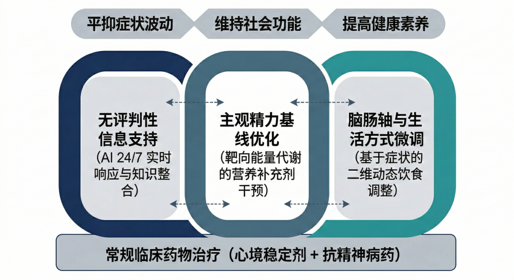
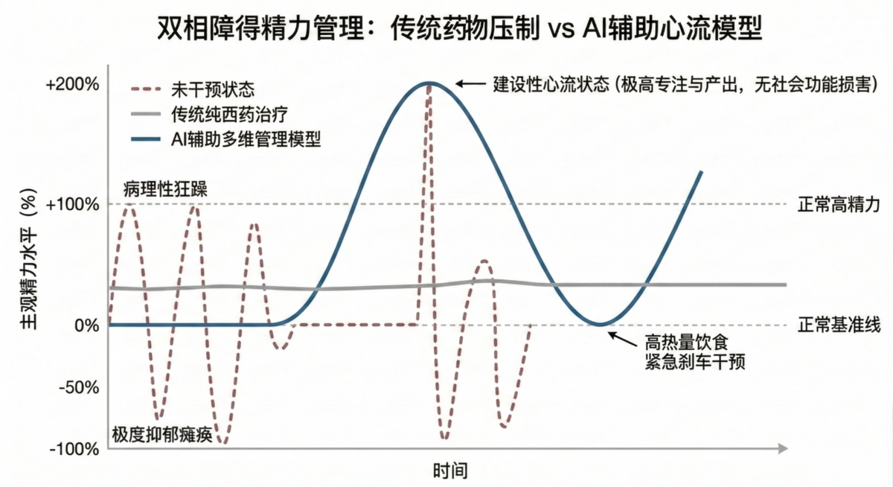
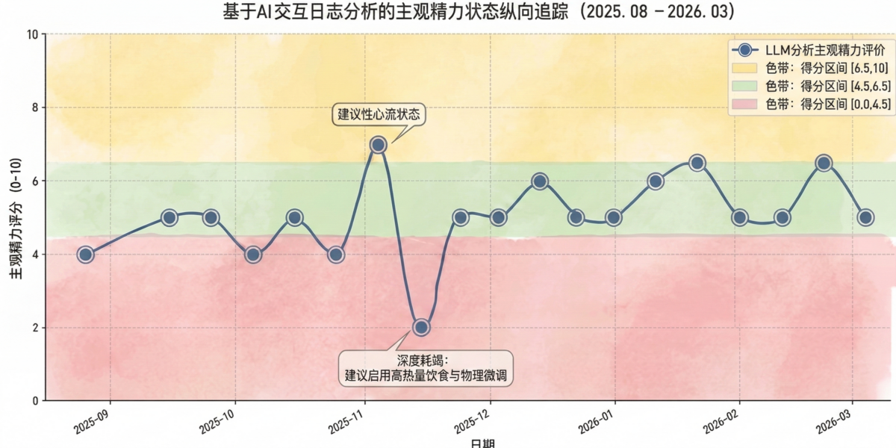
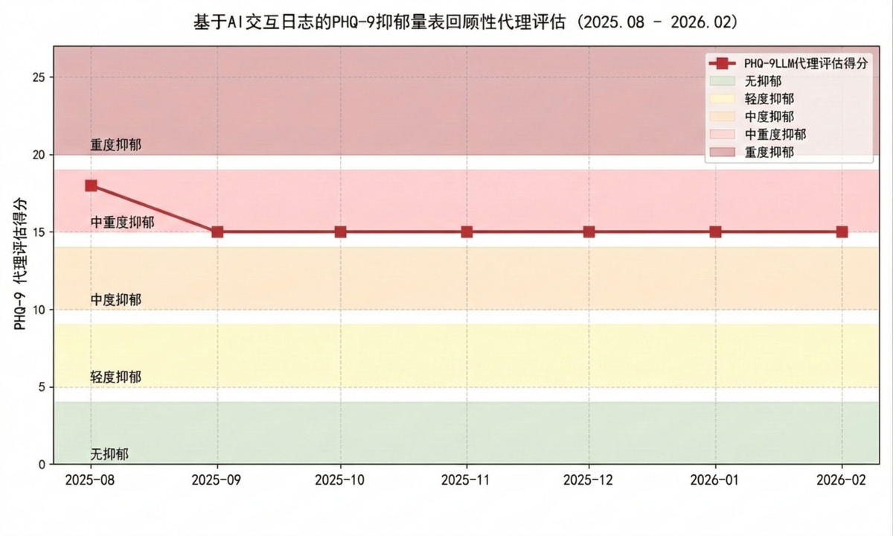

# AI辅助双相障碍自我管理：基于单病例的探索性理论框架与实践观察

<strong>AI-Assisted Self-Management of Bipolar Disorder: An Exploratory Theoretical Framework and Practice Observation Based on a Single Case</strong>

## 摘要

双相障碍患者在院外常面临长期症状管理与医疗资源短缺的困境。生成式人工智能（AI）在健康咨询中展现出潜力，但缺乏针对双相障碍长期自我管理的理论框架与实证数据。本研究采用回顾性单病例观察设计，收集一例双相II型障碍患者长达6个月（2025年8月至2026年2月）的AI辅助管理记录。利用自然语言处理技术对3,734条交互文本（约1.55亿Tokens）进行主题聚类与实体抽取，分析干预模式。数据表明，61.3%的AI交互发生于传统门诊外时段（夜间与凌晨）。研究提炼出四维度管理模型：无评判性信息支持、神经营养干预、动态食疗（多巴胺靶向与脑肠轴）及基于阴阳平衡的物理微调。患者主观报告抑郁期能量衰退与轻躁狂期交感亢奋有所改善，并在特定周期内观察到短效抗焦虑药物替代的可能性。同时，记录了一起因输入信息疏漏引发的AI误导不良事件。本研究初步构建了AI辅助双相障碍管理的多维理论框架，提示其在缓解躯体不适及提升干预依从性方面具有潜力。然而，AI干预存在“自动化偏见”风险，需在“医患-AI”协作框架内作为辅助工具审慎应用。

**关键词**：双相障碍；人工智能；自我管理；脑肠轴；理论框架；数字健康

**数据可用性声明**：本研究涉及的完整脱敏交互数据集、论文全文及可视化分析工具已开源发布，可通过以下地址访问：[https://phd-tianlv.github.io/bipolar-ai-management](https://phd-tianlv.github.io/bipolar-ai-management)

## 1. 引言

双相障碍是一种异质性强、复发率高的精神疾病，其对患者职业功能与生活质量的破坏往往贯穿终生 [1]。临床流行病学数据显示，双相II型障碍患者在其病程中，处于抑郁状态的时间远超轻躁狂状态，且常伴随复杂的自主神经紊乱与躯体不适 [2,3]。当前的基础治疗主要依赖心境稳定剂（如拉莫三嗪）与第二代抗精神病药物的联合使用 [4]。但在真实世界的长期治疗中，患者在维持期常面临多重结构性障碍，包括由于医疗资源紧张导致的就诊不便、复诊间隔期缺乏即时指导，以及长期药物联合治疗所带来的沉重经济负担与代谢副反应 [5]。

在此背景下，数字健康干预（Digital Health Interventions）逐渐被引入慢性精神疾病的院外管理。早期基于规则的对话机器人及移动应用程序在轻中度抑郁和焦虑的干预中已获得部分证据支持 [6,7]。随着大语言模型（LLM）的突破，现代AI对话系统展现出更强大的语境理解与知识整合能力。有研究指出，AI系统具备的“无评判性（non-judgmental）”交互特征，能够显著降低患者在披露敏感症状时的防御心理，从而促进更高质量的病史追踪与情感释放 [8,9]。

然而，针对双相障碍这一病理机制复杂、涉及多系统累及的疾病，目前的数字干预研究多停留在对情绪量表的监测或通用认知行为疗法（CBT）模块的推送，尚未形成系统性的自我管理理论框架。双相障碍发作不仅是中枢神经递质的失衡，还涉及全身能量代谢、免疫炎症及肠道微生态的广泛参与 [10,11]。因此，单一层面的心理支持难以满足患者的真实诉求。

本研究试图跨越单一学科的局限，基于一名双相II型障碍患者长达半年的高频真实世界AI交互数据（涵盖逾3,700条消息与1.55亿Tokens消耗），探索性地归纳出本研究的三项探索性发现（Exploratory Observations）：1）探索补充了时空阻隔与人类心理防御的“无评判性”数字支持网络；2）探索传统药物“削峰平谷”模式之外，将能量状态向“高功能心流”区间抬升的正弦波动管理假说；3）具备较高卫生经济学价值、以“多巴胺补偿”与脑肠轴为核心的动态食疗与物理调控。以此为基础，本研究构建了一个综合性理论框架，以期为未来开发更具针对性的数字健康工具提供概念基础。

## 2. 研究方法

### 2.1 研究设计与参与者

本研究采用回顾性单病例观察设计（Retrospective Single-case Observational Study）。受试者为一例二十余岁男性双相II型障碍患者，正在接受心境稳定剂与第二代抗精神病药物的基础维持治疗。本研究已获得患者本人的书面知情同意，允许其经过脱敏处理的健康数据用于学术发表。

### 2.2 数据收集

收集受试者在2025年8月28日至2026年2月27日（共183天）期间，与三种主流大语言模型（Gemini, Claude, GPT）产生的所有交互文本数据。原始数据经过去标识化（De-identification）与隐私脱敏处理，最终纳入独立交互消息3,734条，累积Tokens消耗量约1.55亿。

### 2.3 数据分析与回顾性量表评估

采用大语言模型辅助的自然语言处理（NLP）方法进行定性与定量分析。首先，利用Python脚本调用大模型API（Gemini-3-flash），对清洗后的日志进行无监督主题聚类（Unsupervised Topic Clustering）与实体抽取（Entity Extraction），提取患者关注的核心干预领域并计算高频词分布。其次，为了解决回顾性研究中客观临床量表缺失的问题，本研究创新性地运用大模型代理评估（LLM-proxied Retrospective Assessment）。通过设计包含标准量表（如PHQ-9抑郁自评量表）的系统提示词，让模型基于患者每10天的日记与交互文本，模拟生成回顾性症状评分，以此交叉验证主观精力的演变趋势。

## 3. 探索性理论框架的构建

基于对940次AI咨询记录的主题分析及患者临床路径的回顾，本研究提炼出AI辅助双相障碍自我管理的三个核心维度的理论假说（详见图1）。这三个维度相互交织，试图在传统药物治疗的“底盘”之上，构建一个更加敏捷且低成本的症状缓冲网络。

*图1：AI辅助双相障碍多维自我管理框架。在常规药物治疗的基础之上，涵盖信息支持、精力基线优化及生活方式微调三大支柱，以实现平抑症状波动、维持社会功能及提高健康素养的目标。*
### 3.1 维度一：跨越时空的无评判性信息支持缓冲带

在传统医疗模式下，医患互动呈现高度的离散性。患者在两次复诊之间，往往需要独自面对症状的细微波动与药物副反应。本框架提出，大语言模型通过其全天候的在线可用性，能够在患者与医疗系统之间构建一个“信息支持缓冲带”。

数据分析显示，该患者44.9%的咨询发生于晚间（18-24时），16.4%发生于凌晨（0-6时）。这一时段往往是抑郁患者焦虑与孤独感最易放大的窗口期。AI系统的即时响应机制，一方面可以阻断患者因孤立无援而产生的灾难化认知；另一方面，其基于算法的中立性回应，排除了人类交往中潜在的道德评判压力。这不仅有助于提升患者的主动参与度，更促使其在长期的互动中，潜移默化地积累了对自身疾病模式的觉察力。

### 3.2 维度二：突破“削峰平谷”，实现主观精力的“正弦式抬升”

双相障碍尤其是其抑郁相，常被视作一种“能量代谢危机”，表现为大脑对能量的利用效率低下与线粒体功能障碍 [11,12,13,15]。此外，有研究提出“能量消耗失调模型（Dysregulated Energy Expenditure Model）”，指出双相障碍的本质是全身能量生成与消耗系统的失衡 [24]。传统的精神科药物治疗（如心境稳定剂）多采取“削峰平谷”的策略。若将未干预时的症状波动视作从-100%（极度抑郁）至+100%（狂躁）的剧烈震荡，纯西药干预往往将其压缩至-50%至+50%的低基线水平。这在避免极端危险发作的同时，也可能导致部分患者出现长期的情感迟钝与功能退化。

本框架基于长期的干预实践并结合“钟摆动力学模型（Pendulum Dynamics Concept）”[25] 提出，在核心神经递质由西药（如拉莫三嗪）维持稳定的安全网内，AI辅助管理的目标不应仅仅是消除症状，而是<strong>试图引导能量基线向上抬升，塑造一种0%至+200%波动的“正弦式心流模型”</strong>。需要说明的是，此处的0%至+200%并非客观的临床生物学指标，而是基于患者主观能量感知（Subjective Energy Perception）与钟摆动力学构建的概念性框架。

结合辅助营养手段（如L-茶氨酸、N-乙酰半胱氨酸、Omega-3等）的精准施加 [16]，该模型试图将患者的轻躁狂倾向转化为建设性的“心流（Flow）”体验（详见图2）。实践数据与主观报告提示，当患者进入此框架定义下的“200%精力状态”时，并未观察到临床上典型的轻躁狂破坏性症状（如冲动消费、极度易怒或注意力涣散），而是表现为较高的专注力与科研产出，且未损害社会功能。这种将病理性能量转化为高功能状态的干预思路，为双相障碍的功能康复提供了一种探索性视角。

*图2：双相障碍精力管理模型对比。展示了传统药物“削峰平谷”策略（曲线B）与本研究提出的AI辅助多维管理模型（曲线C）的差异。新模型将能量基线整体抬升，塑造了介于0%至+200%之间波动的“正弦式心流状态”，并在能量谷底（0%）通过高热量应急干预等手段进行紧急刹车。*

如图3所示，通过LLM代理评估，患者的主观精力状态经历了明显的正弦式波动。在2025年11月中旬，患者遭遇了一次严重的能量耗竭（评分跌至2分的谷底），此时触发了极端的“应急干预”（启用高热量饮食与物理微调）。在干预后，精力迅速反弹，并在11月底至12月期间显著高于基线（进入6.5-10分的“建设性心流状态”区间），提示出现了一次不伴有严重功能损害的轻躁狂发作。随后在2026年初逐渐回落至相对稳定的基线水平（4-6.5分区间），并在2月至3月的换季期间呈现出小幅度的代偿性波动。

此外，为了弥补回顾性研究中客观临床量表的缺失，本研究通过大模型对每月的对话文本进行了PHQ-9（病人健康问卷抑郁量表）的代理评估（见图4）。代理评估结果显示，患者在整个观察期内仍承受着持续的中重度抑郁症状（模拟得分15-18分），核心症状集中于“感到心情低落、抑郁或绝望”以及“做事提不起劲或没有兴趣”。需要说明的是，由于在此次纵向模拟中统一以“月”为颗粒度进行平滑处理，导致该得分区间在中重度抑郁段呈现出较低的时间变异性（平坦线）。尽管这在一定程度上掩盖了短期内情绪波动的细微变化，但这一结果进一步凸显了双相II型障碍长病程抑郁相的顽固底色，同时验证了在极低能量状态下开展激进的应急干预（如高热量饮食与密集艾灸）的临床合理性。

*图3：患者主观精力状态纵向追踪与理论区间映射。基于2025年8月至2026年3月的纵向症状日记与咨询记录，通过大语言模型进行分阶段情感与症状分析提取的量化评分，展示了AI辅助干预下主观精力的实际演变情况。注意图中标注的“极度耗竭”谷底（2025年11月），此阶段触发了包括高热量饮食与密集物理微调（如高频艾灸）在内的综合“极端应急干预”。*

*图4：PHQ-9回顾性代理评估（2025.08 - 2026.02）。通过大语言模型模拟评估患者每月的抑郁症状严重程度，验证了其长期的中重度抑郁状态。*
### 3.3 维度三：基于脑肠轴理论的生活方式微调干预

脑肠轴（Gut-Brain Axis）机制表明，肠道微生态环境及胃肠道迷走神经的传入信号，能够直接影响中枢5-羟色胺和多巴胺等递质的合成与分泌 [10,14]。由于饮食是调控肠道环境最直接的手段，本框架提出，系统性的日常饮食质地与成分管理，可能构成双相障碍维持期的一种高卫生经济学价值的辅助干预。

本案例患者在AI的辅助下，结合了脑肠轴理论与对“多巴胺奖赏”的敏锐感知，形成了一个动态的双向调节模型。特别是在患者遭遇精力完全耗竭、陷入极端抑郁与焦虑（即能量跌至0%状态）时，传统清淡饮食往往无法快速救急。此时，AI作为辅助工具会突破常规健康认知，推荐“高热量应急饮食干预（奖赏系统激活与下丘脑-垂体-肾上腺轴反馈假说）”——即摄入如高油脂的炸鸡等“爽感食物（Comfort food）”。此类高热量干预旨在通过胃肠道的强烈充盈感、短期多巴胺的释放以及代谢底物的快速补充，有效钝化下丘脑-垂体-肾上腺（HPA）轴的急性应激反应 [18,19,26]，从而快速阻断焦虑向下螺旋，实现情绪的“紧急刹车”。相反，在轻躁狂期伴随交感极度亢奋、代谢率非正常升高时，则增加富含水分及电解质的温润汤类，试图通过局部神经刺激向下丘脑传递饱腹与安全的生理信号，间接下调交感神经张力。此类动态干预的优势在于极具性价比，几乎不增加额外经济成本，且充分利用了人类趋利避害的本能，患者依从性极高（详见图5）。

*图5：双相障碍不同病期症状的饮食调整策略（二维矩阵模型）。X轴代表能量状态（双相病期），Y轴代表伴随躯体症状。结合脑肠轴假说，展示了针对性的个体化干预措施。*
### 3.4 维度四：基于阴阳平衡的自主神经物理微调

在双相障碍的发作期，患者常伴随严重的自主神经功能紊乱，如极度焦虑、心悸或失眠。这些症状在传统中医语境下可被部分映射为“上热下寒”或“心肾不交”。本框架基于患者的长期实践，引入了一种以“艾灸”为主的物理微调机制，并提出<strong>“1:2平衡定律”</strong>作为核心原则。

在干预早期，患者曾因单纯艾灸上焦穴位（如内关、神门以期缓解焦虑）而引发口干、咽痛及心烦加重，此即中医所谓“烤干津液，助长虚火”。通过AI辅助的逻辑溯源与反复实验，患者确立了<strong>“艾灸上焦穴位1份时间，必须配合艾灸下焦穴位（如涌泉、太冲）2份时间”</strong>的治疗定式。该定式的核心在于“引火归元”，即在平抑交感神经极度亢奋（君火）的同时，通过刺激末梢血液循环（温下焦）来稳固自主神经系统的整体张力 [20,21]。

本案例显示，患者在依从该干预SOP后，成功在特定抑郁/焦虑并发期内实现了对短效抗焦虑药物（奥沙西泮）的替代降阶。值得指出的是，由于双相障碍具有强烈的季节性发作特征（Seasonal Pattern），患者的干预方案始终处于动态迭代之中。例如，在随访期末尾（2026年2月底至3月初，正值冬春交替），患者因疑似季节性抑郁引发症状波动（郁期与轻躁期交替明显），原有的稳定期SOP出现“压制力不足”的现象。基于此，患者再次启用AI辅助进行紧急微调，将中成药（乌灵胶囊）的日剂量临时上调，新增疏肝解郁类中成药（如逍遥丸）[23]，并重启了高频次的艾灸（内关、神门）以重新平衡自主神经张力。

这种“稳定期维持—波动期升级”的动态响应模式，正是本多维调控闭环（涵盖“信息-能量-肠道-神经”）的核心特征，也是防范全面复发不可或缺的防线。

**表1：双相障碍AI辅助自我管理每日SOP清单（基线期/波动期干预对比例）**

| 执行时段              | 具体干预措施（西药/中成药/膳食补充剂/食疗/物理）                                                               | 目标与机制假说                                        |
| -- | - | - |
| **早起**            | **西药**：拉莫三嗪 (75mg)  **神经营养**：L-茶氨酸 (400mg)                     | 稳定中枢神经递质基线；平抑晨间交感神经张力与皮质醇唤醒反应。                 |
| **餐一**            | **中成药**：乌灵胶囊 (3粒)  **补充剂**：全谱消化酶、B-50、D3-5000iu、NAC (600mg)、胶原蛋白肽 (3g) | 补肾健脑；通过消化酶优化肠道吸收；NAC提供抗氧化与抗神经炎症底物；B族/D3支持中枢代谢。 |
| **加餐**            | **食疗**：银耳莲子羹（餐后2h）、医学全营养蛋白粉（餐后4h）                                                        | 滋阴润肺，维持血糖平稳波动，防止能量代谢出现“断崖式下跌”。                 |
| **餐二**            | **中成药**：乌灵胶囊 (3粒)  **补充剂**：全谱消化酶、EPA (1000mg)、叶黄素、胶原蛋白肽 (3g)                              | EPA进一步对抗中枢神经炎症；持续提供系统性的神经营养支持。                 |
| **入睡**            | **西药**：拉莫三嗪 (75mg)、喹硫平 (25mg)  **补充剂**：磷脂酰丝氨酸 (200mg)、甘氨酸镁 (400mg)  **物理**：泡脚 (20min)、蒸汽眼罩 | 稳定心境并强制诱导睡眠；镁剂降低神经元兴奋性；物理温煦引血下行，促进副交感神经主导。     |
| **动态升级（季节性/发作期）** | **极端应急**：高热量应急饮食(靶向多巴胺)、重启艾灸机制(内关/神门及下焦，1:2定律)  **季节性抑郁加药**：早起临时增加乌灵胶囊(3粒)；早起及餐一新增逍遥丸(各8粒)疏肝解郁 [23]；**策略微调**：将B-50与D3(5000iu)从餐一前置至早起并搭配热牛奶/医学蛋白粉服用（防止因抑郁期食欲减退导致漏服），强力唤醒晨间能量 [22]。 | 应对冬春交替等季节性抑郁/轻躁狂波动，强力下调自主神经张力，优化给药依从性并补充晨间能量底物，阻断症状恶化。          |

## 4. 实践观察与数据分析

### 4.1 咨询模式与时序特征

本研究观察期为183天（2025年8月28日至2026年2月27日），共纳入独立交互消息3,734条，总计消耗约1.55亿Tokens。使用频率呈现明显的初期爆发与后期平稳的特征：2025年10月（第3个月）达到峰值，主要由于在此期间患者的临床症状发生波动且频繁调整干预方案；随后咨询频率趋于稳定，提示患者逐渐建立起结构化的自我管理习惯。

值得注意的是，该患者在交互中极其频繁地应用了<strong>“多模型交叉验证（Multi-model Cross-validation）”</strong>策略。数据记录显示，患者共进行了2,620次模型切换，涉及3个主流大语言模型（Gemini, Claude, GPT）的不同版本。这一策略与近期探讨的大语言模型“交叉一致性校验（Cross-validation frameworks）”研究不谋而合 [27]，有效规避了单一模型可能存在的“幻觉（Hallucinations）”，显著提高了药物机制解释与中医辨证在医疗语境下的安全性与准确性。

通过对对话内容进行无监督的主题聚类分析，发现关于躯体症状分析（含中医辨证与自主神经调控）占据最大比重（约32%），其次是日常饮食与物理干预的咨询（约24%）与营养补充剂/药物调整的探讨（约29%）。这一分布印证了患者在院外管理中，对躯体化症状缓解和非药物干预措施存在强烈的未被满足的需求。

**表2：AI辅助自我管理关键指标与数据统计**

| 指标类别          | 数据/内容                         | 备注说明                        |
| --- | --- | --- |
| **观察期时长**     | 183天                          | 2025年8月28日至2026年2月27日       |
| **交互消息总数**    | 3,734条                        | 平均约20.4条/日                  |
| **Tokens消耗量** | 约 1.55亿                       | 反映了极高的对话上下文密度               |
| **应用模型数量**    | 3个                            | Gemini、Claude、GPT（涵盖多个不同版本） |
| **模型切换次数**    | 2,620次                        | 频繁的多模型交叉验证，用于降低AI“幻觉”风险     |
| **交互高发时段**    | 晚间及凌晨占 61.3%                  | 18-24时(44.9%)，0-6时(16.4%)   |
| **核心讨论主题**    | 躯体症状(32%)、补充剂(29%)、物理/食疗(24%) | 突出对非药物与躯体层面的高度关注            |

### 4.2 不良事件记录

在一味强调数字干预潜力的同时，本观察也记录了其内在的脆弱性。随访期间曾发生一次由于患者输入信息遗漏（未提及服用L-酪氨酸）导致的AI误判事件。AI基于片面症状生成了具有潜在风险的中医方剂建议，患者在缺乏交叉验证的情况下盲从，导致了数日的严重抑郁与躯体疲劳。

该事件暴露了AI对话系统在医疗场景中的根本性缺陷：其输出的质量严苛依赖于输入信息的完整度（Garbage in, garbage out）。由于AI缺乏真实医生的直觉追问能力与执业责任锚点，完全去中心化的自我管理极易陷入“自动化偏见”的陷阱。

## 5. 讨论

本研究通过对单病例的纵向观察，尝试勾勒出AI辅助双相障碍自我管理的多维理论轮廓。与以往侧重于心理量表测评的数字应用不同，本框架强调了从宏观的信息支持到微观的饮食渗透压改变的综合作用体系。

本框架提出，日常饮食不应仅被视为基础的热量摄入，而应被重塑为一种结合自主神经系统、多巴胺奖赏与脑肠轴的低烈度、高频次的“急救与维持”手段。这种非药物层面的管理，因其具备极高的卫生经济学可行性与几乎为零的代谢毒性，且能以“低阻力”的方式迎合患者当下的生理本能（如情绪极低谷时的高热量摄入），尤其适合作为慢性期精神疾病管理的底盘。

其次，研究凸显了患者在这一新型健康管理模式中的“双刃剑”角色。理想状态下，患者通过与大语言模型的持续交互，能够显著提升自身的健康素养（Health Literacy），从被动的受治者转变为主动的协作者。然而，这也对患者的认知批判能力提出了极高的门槛。现实中，广大精神疾病患者由于认知功能的受损，可能无法甄别AI系统生成的“幻觉（Hallucinations）”或具有伪科学包装的危险建议 [17]。

因此，本研究不主张患者脱离正规医疗体系进行完全的“自我诊疗”。相反，本框架的未来发展方向应当是嵌入“医生-AI-患者”的三角协作生态中：由医生设定安全边界与基石药物，AI负责日常的症状跟踪、生活方式提醒与低风险的非药物干预建议生成，从而在确保安全性的前提下最大化医疗资源的覆盖半径。

### 5.1 局限性

必须强调，本研究所提出的理论框架和实践观察高度受限于单一的受试者背景。首先是<strong>“研究者-受试者同一性偏倚（Researcher-Subject Identity Bias）”</strong>。该患者作为AI领域的博士研究人员，其信息检索能力、对LLM提示词工程的掌握以及处理复杂逻辑思辨的能力，构成了极强的混杂因素。这导致本文中观察到的积极主观疗效在多大程度上归因于干预框架本身，又在多大程度上源于患者极高的个人素养与安慰剂效应，目前尚无法分离。普通患者若在缺乏医学逻辑的情况下模仿这种高度去中心化的干预，极易因AI“幻觉”受到严重伤害。

其次，本研究创新性采用的大语言模型代理评估（LLM-proxied Retrospective Assessment）虽提供了纵向的定量参考，但其提取的“模拟得分”本质上仍是对患者主观日记的二次加工，尚未经过与传统人工测评金标准（如由专业医师施测的HAMD、YMRS量表）或客观生理指标（如可穿戴设备记录的睡眠与心率变异性）的严谨对比验证。未来亟需开发适配普通患者认知水平的定制化AI界面，并在多中心、大样本的随机对照试验中进一步验证本框架的假设。

## 6. 结论

本研究构建了一个探索性的AI辅助双相障碍自我管理理论框架。该框架尝试将数字平台的信息即时性与基于能量代谢及脑肠轴的生活方式干预相融合。在为期6个月的单病例观察中，该干预模式显示出改善患者主观躯体不适、平抑症状剧烈波动的初步潜力，且具备显著的经济可及性。尽管大语言模型在心理健康支持领域展现出一定的应用潜力，但其偶发的错误推理和对患者批判性思维的严苛要求，提示其应用必须恪守辅助性的边界。进一步的技术迭代与严格的临床验证，是推进这一理论走向普适性临床应用的前置条件。

## 参考文献

1. McIntyre RS, Berk M, Brietzke E, et al. Bipolar disorders. Lancet. 2020;396(10265):1841-1856.
2. Judd LL, Akiskal HS, Schettler PJ, et al. A prospective investigation of the natural history of the long-term weekly symptomatic status of bipolar II disorder. Arch Gen Psychiatry. 2003;60(3):261-269.
3. Tondo L, Vázquez GH, Baldessarini RJ. Depression and Mania in Bipolar Disorder. Curr Neuropharmacol. 2017;15(3):353-358.
4. Yatham LN, Kennedy SH, Parikh SV, et al. Canadian Network for Mood and Anxiety Treatments (CANMAT) and International Society for Bipolar Disorders (ISBD) collaborative update of CANMAT guidelines for the management of patients with bipolar disorder. Bipolar Disord. 2018;20(2):97-170.
5. Chakrabarti S. Treatment Attitudes and Adherence Among Patients with Bipolar Disorder: A Systematic Review of Quantitative and Qualitative Studies. Harv Rev Psychiatry. 2019;27(5):306-324.
6. Lattie EG, Adkins EC, Winquist N, et al. Digital Mental Health Interventions for Depression, Anxiety, and Enhancement of Psychological Well-Being Among College Students: Systematic Review. J Med Internet Res. 2019;21(7):e12869.
7. Boucher EM, Harake NR, Ward HE, et al. Artificially intelligent chatbots in digital mental health interventions: a review. Expert Rev Med Devices. 2021;18(sup1):37-49.
8. Pham KT, Nabizadeh A, Selek S. Artificial Intelligence and Chatbots in Psychiatry. Psychiatr Q. 2022;93(1):249-253.
9. Prochaska JJ, Vogel EA, Chieng A, et al. A Therapeutic Relational Agent for Reducing Problematic Substance Use (Tess): Design and Acceptability Study. J Med Internet Res. 2021;23(3):e24850.
10. Góralczyk-Bińkowska A, Szmajda-Krygier D, Kozłowska E. The Microbiota-Gut-Brain Axis in Psychiatric Disorders. Int J Mol Sci. 2022;23(19):11245.
11. Morris G, Berk M, Walder K, et al. The Putative Role of Oxidative Stress and Inflammation in the Pathophysiology of Sleep Dysfunction across Neuropsychiatric Disorders: Focus on Chronic Fatigue Syndrome, Bipolar Disorder and Multiple Sclerosis. Sleep Med Rev. 2018;41:255-265.
12. Clay HB, Sillivan S, Konradi C. Mitochondrial dysfunction and pathology in bipolar disorder and schizophrenia. Int J Dev Neurosci. 2011;29(3):311-324.
13. Lam XJ, Xu B, Yeo PL, et al. Mitochondria dysfunction and bipolar disorder: From pathology to therapy. IBRO Neurosci Rep. 2023;14:407-418.
14. Generoso JS, Giridharan VV, Lee J, et al. The role of the microbiota-gut-brain axis in neuropsychiatric disorders. Braz J Psychiatry. 2021;43(3):293-305.
15. Kim Y, Vadodaria KC, Lenkei Z, et al. Mitochondria, Metabolism, and Redox Mechanisms in Psychiatric Disorders. Antioxid Redox Signal. 2019;31(4):275-317.
16. Sarris J, Ravindran A, Yatham LN, et al. Clinician guidelines for the treatment of psychiatric disorders with nutraceuticals and phytoceuticals: The World Federation of Societies of Biological Psychiatry (WFSBP) and Canadian Network for Mood and Anxiety Treatments (CANMAT) Taskforce. World J Biol Psychiatry. 2022;23(6):424-455.
17. Goddard K, Roudsari A, Wyatt JC. Automation bias: a systematic review of frequency, effect mediators, and mitigators. J Am Med Inform Assoc. 2012;19(1):121-127.
18. Qiao Y, Cheng R, Zheng H, et al. The impact of a high-fat diet (HFD) on mouse behavior, neurotransmitters, inflammation, and gut-brain axis metabolism under hypoxic conditions. Behav Brain Res. 2025;482:115456. (PMID: 40840769)
19. Karatayev O, Leibowitz SF. Melanin-Concentrating Hormone (MCH): Role in Mediating Reward-Motivated and Emotional Behavior and the Behavioral Disturbances Produced by Repeated Exposure to Reward Substances. Int J Mol Sci. 2025;26(15):8047. (PMID: 40806293)
20. Fu S, He K, Zhou C. Curative Effect and Autonomic Nerve Function of Patients With Primary Insomnia of Liver Depression and Spleen Deficiency Type Based on the Acupoint Selection of Meridian Theory: Protocol for a Randomized Controlled Trial. JMIR Res Protoc. 2026;15:e63380. (PMID: 41570299)
21. Li X, Chen Z, Sun S. [Autonomic dysfunction in multiple system atrophy treated with Sun's scalp acupuncture combined with yinyang needling therapy: a case report]. Zhongguo Zhen Jiu. 2026;46(1):83-86. (PMID: 41558702)
22. Gloth FM 3rd, Alam W, Hollis B. Vitamin D vs broad spectrum phototherapy in the treatment of seasonal affective disorder. J Nutr Health Aging. 1999;3(1):5-7. (PMID: 10888476)
23. Zhang Y, Han M, Liu Z, et al. Chinese herbal formula xiao yao san for treatment of depression: a systematic review of randomized controlled trials. Evid Based Complement Alternat Med. 2012;2012:931636.
24. Morris G, Walder K, Carvalho AF, et al. What is bipolar disorder? A disease model of dysregulated energy expenditure. Neurosci Biobehav Rev. 2020;113:308-323.
25. Rihmer A, Gonda X, Rihmer Z. Mood regulation in bipolar disorders viewed through the pendulum dynamics concept. Int J Bipolar Disord. 2014;2(1):9.
26. Ulrich-Lai QM, Fulton S, Wilson M, et al. Stress exposure, food intake and emotional state. Stress. 2011;14(4):381-399.
27. Chen Y, Zhao Y, Wang Y, et al. Combining LLMs and Knowledge Graphs to Reduce Hallucinations in Biomedical Question Answering. J Pers Med. 2025;5(4):70.
